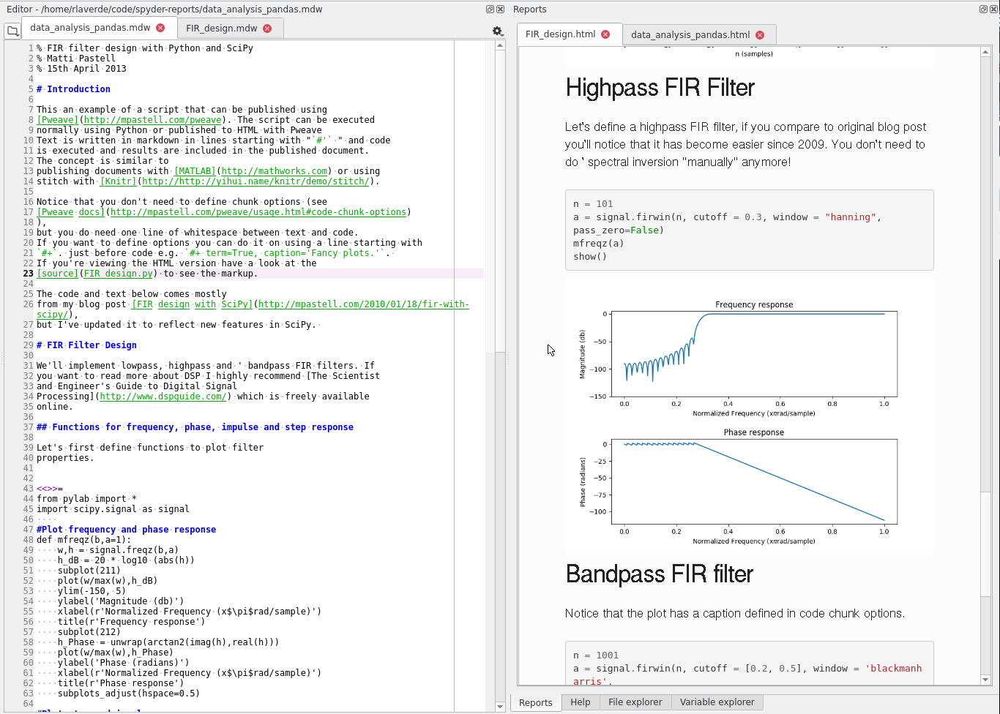

Spyder reports plugin 
=====================

Spyder plugin to render Markdown reports using
`Pweave <https://github.com/mpastell/Pweave>`_ as a backend.
It only works in Python 3 because Pweave only works in Python 3.

Build status
------------
|circleci status| |coverage|

Project information
-------------------
|license| |pypi version| |gitter|

.. |circleci status| image:: https://img.shields.io/circleci/project/github/spyder-ide/spyder-reports/master.svg
  :target: https://circleci.com/gh/spyder-ide/spyder-reports/tree/master
  :alt: Circle-CI build status
.. |license| image:: https://img.shields.io/pypi/l/spyder-reports.svg
  :target: LICENSE.txt
  :alt: License
.. |pypi version| image:: https://img.shields.io/pypi/v/spyder-reports.svg
  :target: https://pypi.python.org/pypi/spyder-reports
  :alt: Latest PyPI version
.. |gitter| image:: https://badges.gitter.im/spyder-ide/spyder-reports.svg
  :target: https://gitter.im/spyder-ide/spyder-reports
  :alt: Join the chat at https://gitter.im/spyder-ide/spyder-reports
.. |coverage| image:: https://coveralls.io/repos/github/spyder-ide/spyder-reports/badge.svg
  :target: https://coveralls.io/github/spyder-ide/spyder-reports?branch=master
  :alt: Code Coverage

Installation
------------

Using conda

``conda install spyder-reports -c spyder-ide``

Using pip

``pip install spyder-reports``

Dependencies
------------

This project depends on:

* `Spyder <https://github.com/spyder-ide/spyder>`_ >= 3.2
* `Pweave <https://github.com/mpastell/Pweave>`_
* `Pandoc <https://github.com/jgm/pandoc>`_

Overview
--------

